## PROBLEMA
Las páginas de tiendas para damas no siempre tienen la información ni el stock actualizado de los productos.

## RETO
Realizar una página que tengas las dos siguientes vistas:
- Comprador:
Brindar un catálogo online que permite ver los precios, stock, fotos y detalle de los productos.
- Administrador:
Puede agregar editar, eliminar, actualizar productos 

**Público Objetivo**
- Millenials mujeres de 18 a 35 años

## Benchmarking
Realizamos un estudio de Benchmarking , nos ofrece un contexto de comparación inmediato con respecto a nuestros iguales (competidores directos e indirectos) permitiéndonos saber si estamos haciendo bien las cosas o si tenemos margen para mejorarlas y detectar oportunidades, amenazas así como debilidades y fortalezas que provienen de nuestro entorno de competidores.

## STAKEHOLDERS
- CEO
- Gerente de Marketing
- Director de proyecto
- Diseñador web
- Millenialls mujeres

## REUNIÓN KICK OFF
[**AGENDA DE ACTIVIDADES**](http://docs.google.com/document/d/1_vooE_yBEE2rj1v3dcruDtJjUTviaZnZblBrozv6L0I/edit)

### PREGUNTAS
**Cliente Interno**

## BUSINESS MODEL CANVAS
### ORIENTADO A COMPRADORES

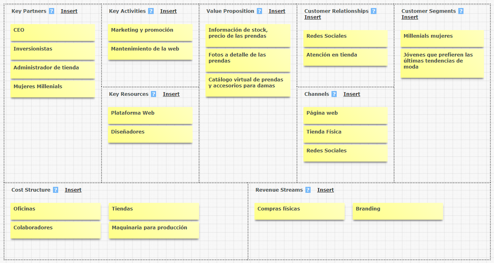

### ORIENTADO A ADMINISTRADORES

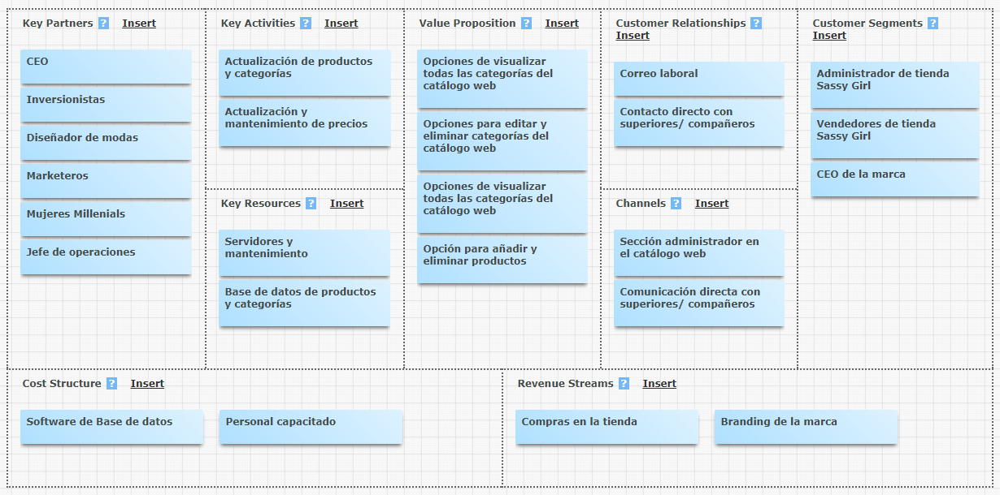

## PLAN DE INVESTIGACIÓN
### OBJETIVOS
- Comprender qué tipo de productos son los que adquiere con mayor frecuencia nuestro público objetivo.

- Entender el proceso realizan antes y durante de realizar una compra nuestro público objetivo.

- Conocer que influye en la decisión y elección de nuestro público objetivo al realizar una compra.

-  Determinar las características principales de nuestro usuario.

**HERRAMIENTAS**
- Benchmarking
- Encuestas
- Entrevistas a profundidad
- Diagrama de afinidad
- Testing

**ACTIVIDADES PLANEADAS**
## ETAPAS
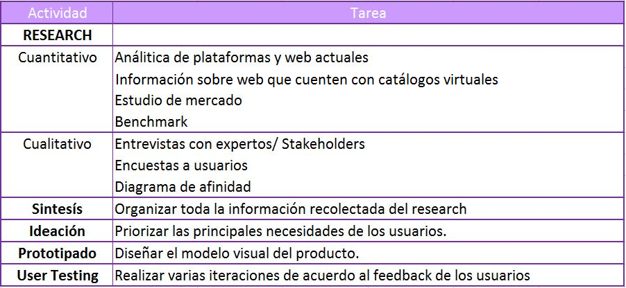

### 1. Descubrimiento e investigación

- Formulación de cuestionario y guía de entrevistas
- [Encuestas online](https://docs.google.com/forms/d/e/1FAIpQLSdsot1wmRGD46ARa3YwvIAklEjfI7VOVnMYm07HAD3izOiCGA/viewform)
Se realizó encuestas que fueron enviadas a un público de alrededor 40 personas a través de internet, con la finalidad de darnos una idea de la situación actual, características de los usuarios, comportamientos financieros, preferencias, problemática, etc.
- Entrevistas a profundidad
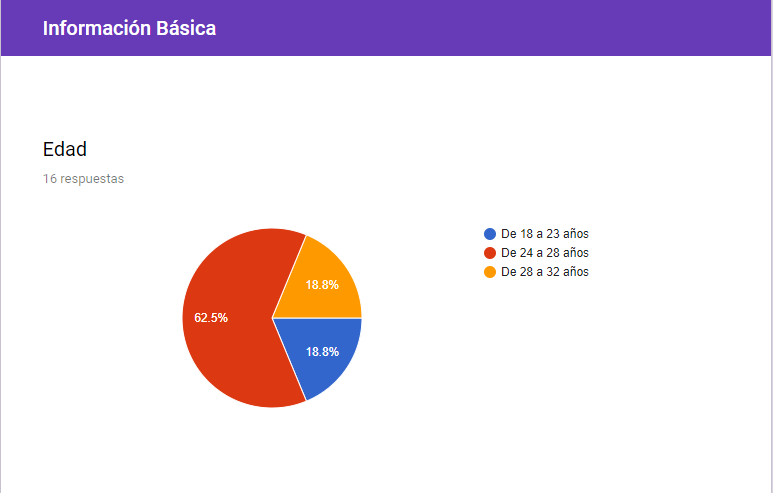
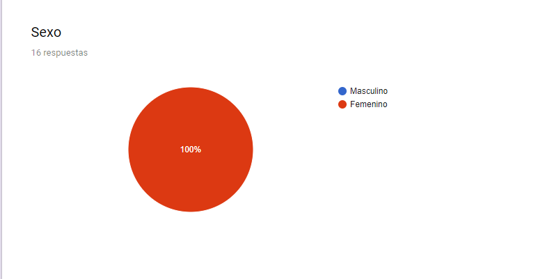
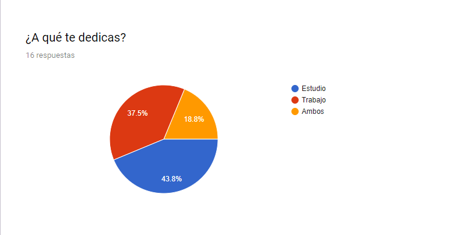
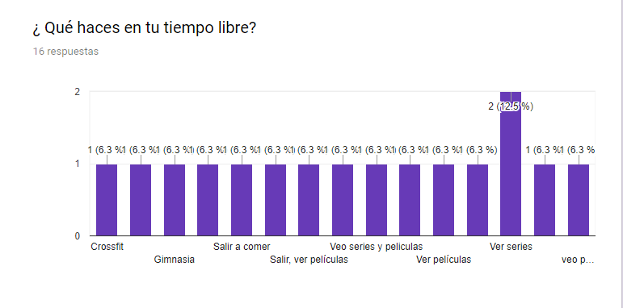
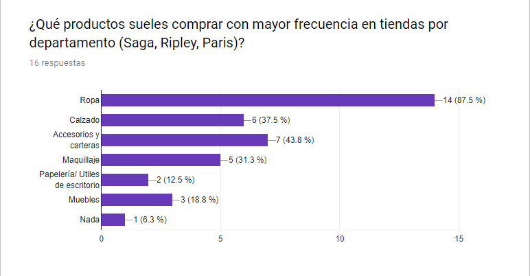
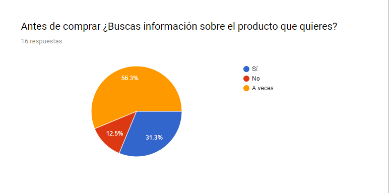
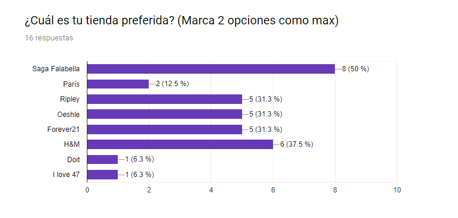
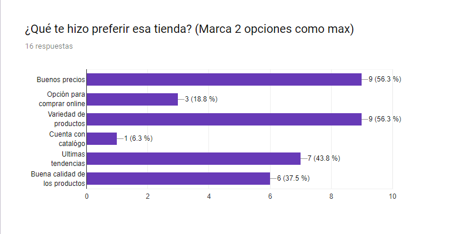
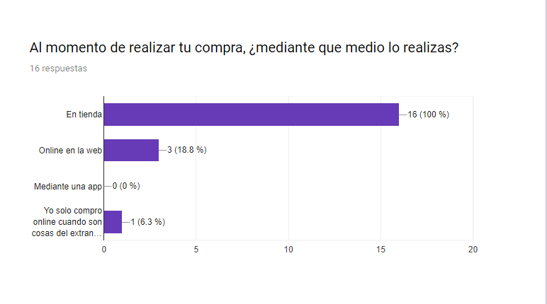
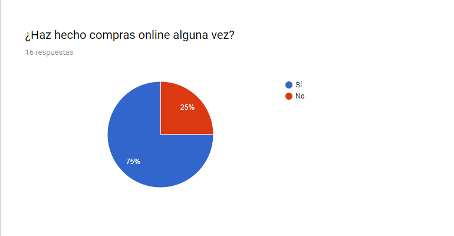
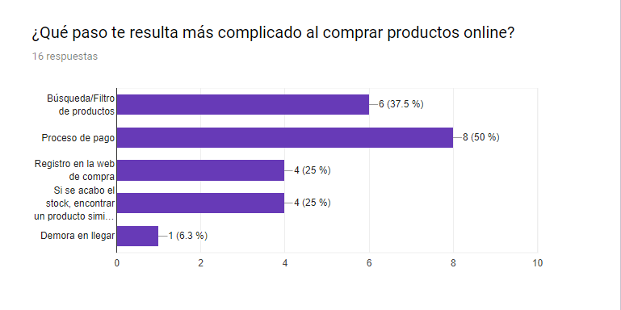
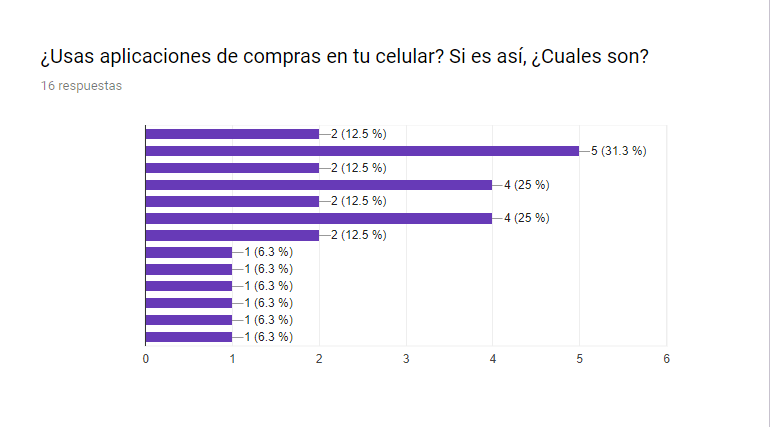

### 2. Síntesis e Ideación
En esta etapa nos enfocamos en obtener los insights de los usuarios a través de la recopilación y análisis de información de nuestra investigación.

**DIAGRAMA DE AFINIDAD**

Se realizó un diagrama de Afinidad con la finalidad de poder analizar los datos obtenidos de las encuestas y entrevistas y agruparlos de acuerdo a las similutes de las respuestas. Los temas encontrados fueron :

**CONCEPTUALIZACIÓN**

En base a la información recabada decidimos enfocarnos en los siguientes beneficios para los usuarios:
- Productos de ropa y accesorios
- Plataforma simple 
- Información sobre stock, y precios.
- Principales ofertas resaltadas en la vista inicial

**USER PERSONA**

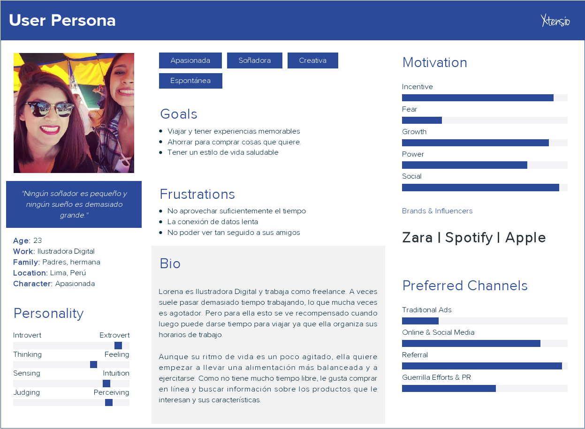

### 3. Prototipado y Testing
**PAPER PROTOTYPING**

Los primeros testing los realizamos en papel y el feedback que obtuvimos fue el siguiente:
- No entendían el término organizador, designado para ser un tracker de gastos. Pensaron que era como una agenda.
- Querían compartir la constancia de sus transacciones no solo por correo, sino por Whatsapp y otras aplicaciones.
- Sugirieron una sección de atención al cliente, en caso de inconvenientes en sus operaciones.
- Confusión en cuanto al método de registro.
- Les pareció amigable y sencillo.
- Querían una sección para encontrar sus operaciones más frecuentes/favoritas.
- Confusión al momento de seleccionar el banco con el que realizar sus operaciones.

**ALTA FIFELIDAD**
- Le gustaron los colores
- Faltó aliación entre las secciones
- Falto una sección de movimientos detallados de la cuenta.

**MARVEL**

- Transacciones: https://marvelapp.com/2e96496/screen/39518702
- Pago de servicios: https://marvelapp.com/2e96496/screen/39518693

### Miembros
- Nataly Cortez
- Ruth Matos
